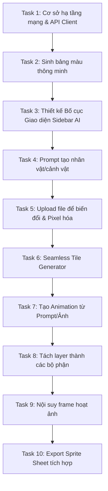

# Kế Hoạch Triển Khai Dự Án: Tích Hợp AI Vào MonoSprite (MonoSprite AI Extension)

Tài liệu này cung cấp kế hoạch thiết kế và triển khai chi tiết cho việc tích hợp các mô hình AI hỗ trợ vẽ Pixel Art và làm Animation vào phần mềm MonoSprite. Trình tự các nhiệm vụ (tasks) được sắp xếp từ dễ đến khó, đảm bảo tính kế thừa cao, tránh xung đột mã nguồn và dễ dàng cho lập trình viên (kể cả Intern) tiếp cận.

---

## Tổng Quan Kiến Trúc Kỹ Thuật

*   **Ngôn ngữ chính:** C++11 trở lên.
*   **Giao diện:** Bộ công cụ Laf UI (được định nghĩa qua XML trong `data/widgets/` và dựng lớp trong `src/app/ui/`).
*   **Mạng:** Thư viện `libcurl` đóng gói trong `src/net/http_request.h` để giao tiếp với AI Server.
*   **AI Backend:** Sử dụng mô hình Cloud API (như Replicate, Fal.ai, Stable Diffusion API) hoặc kết nối với Local Server (như ComfyUI / Automatic1111) để xử lý tác vụ nặng, tránh làm phình dung lượng app.

---

## Lộ Trình Triển Khai (Roadmap)



---

## Chi Tiết Các Nhiệm Vụ Triển Khai

### Task 1: Cơ sở hạ tầng mạng & API Client (Network Infrastructure)
*   **Mục tiêu:** Xây dựng một lớp client trung gian để gửi request HTTP POST/GET (JSON và Multipart Form-Data để upload ảnh) lên AI server và parse kết quả JSON trả về.
*   **Vị trí file cần chỉnh sửa/tạo mới:**
    *   `[NEW]` [ai_client.h](file:///d:/Dev_App/MonoSprite/src/net/ai_client.h)
    *   `[NEW]` [ai_client.cpp](file:///d:/Dev_App/MonoSprite/src/net/ai_client.cpp)
*   **Phương pháp / Cách làm chi tiết:**
    1.  Tận dụng lớp `net::HttpRequest` (đã có sẵn trong [http_request.h](file:///D:/Dev_App/MonoSprite/src/net/http_request.h)) để thực hiện gửi dữ liệu.
    2.  Nếu dự án chưa tích hợp thư viện JSON, sử dụng một thư viện header-only nhẹ như `nlohmann/json` đặt trong `third_party/` để phân tích chuỗi JSON trả về từ API AI.
    3.  Hỗ trợ 2 phương thức chính:
        *   `postJson(url, headers, body_json)`: Dành cho các API nhận text prompt.
        *   `postMultipart(url, headers, file_path, fields)`: Dành cho việc upload ảnh gốc lên để xử lý Img2Img.
*   **Cấu trúc mã nguồn tham khảo:**
    ```cpp
    namespace net {
    class AiClient {
    public:
        AiClient(const std::string& baseUrl);
        bool generateTextToImage(const std::string& prompt, std::string& outPngBase64);
        bool uploadAndProcessImage(const std::string& imagePath, const std::string& prompt, std::string& outPngBase64);
    private:
        std::string m_baseUrl;
    };
    }
    ```
*   **Cách kiểm tra và nghiệm thu:** Viết một test case đơn giản trong thư mục `src/tests/` để gọi thử API giả lập (Mock API) hoặc gọi trực tiếp API của Stable Diffusion cục bộ và ghi log ra console.

---

### Task 2: Sinh bảng màu thông minh (Smart Palette Generator)
*   **Mục tiêu:** Cho phép người dùng nhập mô tả (ví dụ: "Cyberpunk neon palette", "Forest moss retro") để sinh ra một bảng màu giới hạn (16 hoặc 32 màu) và áp dụng trực tiếp vào Palette hiện tại của canvas.
*   **Vị trí file cần chỉnh sửa/tạo mới:**
    *   `[NEW]` [palette_generator_cmd.cpp](file:///d:/Dev_App/MonoSprite/src/app/commands/filters/palette_generator_cmd.cpp) (đăng ký lệnh sinh palette).
    *   `[MODIFY]` [color_bar.cpp](file:///d:/Dev_App/MonoSprite/src/app/ui/color_bar.cpp) (thêm nút bấm hoặc menu phụ để kích hoạt lệnh).
*   **Phương pháp / Cách làm chi tiết:**
    1.  Tạo một hộp thoại đơn giản (`ui::Window`) yêu cầu nhập Prompt tạo màu.
    2.  Gửi prompt qua `AiClient` đến API AI (ví dụ một mô hình LLM hoặc Stable Diffusion được chỉ dẫn trả về mã màu HEX dạng: `["#ff0000", "#00ff00", ...]`).
    3.  Parse mảng HEX nhận được.
    4.  Sử dụng đối tượng `doc::Palette` trong MonoSprite để ghi đè bảng màu:
        ```cpp
        doc::Palette* palette = app::UIContext::instance()->activeDocument()->sprite()->palette(0);
        palette->resize(hexColors.size());
        for (int i = 0; i < hexColors.size(); ++i) {
            palette->setEntry(i, doc::rgba(r, g, b, 255));
        }
        // Cập nhật lại UI hiển thị bảng màu
        app::ColorBar::instance()->updatePalette();
        ```
*   **Cách kiểm tra và nghiệm thu:** Nhập thử prompt "desert twilight", kiểm tra xem bảng màu bên trái ứng dụng có cập nhật sang màu cam, tím, vàng cát hay không.

---

### Task 3: Thiết kế Bố cục Giao diện Sidebar AI (UI Layout & Base Panels)
*   **Mục tiêu:** Tạo bố cục chia đôi màn hình: Bên trái là khu vực làm việc của MonoSprite, bên phải là thanh Sidebar AI.
*   **Vị trí file cần chỉnh sửa/tạo mới:**
    *   `[MODIFY]` [main_window.xml](file:///D:/Dev_App/MonoSprite/data/widgets/main_window.xml) (Điều chỉnh layout XML).
    *   `[NEW]` [ai_sidebar.h](file:///d:/Dev_App/MonoSprite/src/app/ui/ai_sidebar.h)
    *   `[NEW]` [ai_sidebar.cpp](file:///d:/Dev_App/MonoSprite/src/app/ui/ai_sidebar.cpp)
*   **Phương pháp / Cách làm chi tiết:**
    1.  Cập nhật file XML `main_window.xml`: chèn một `ui::Splitter` nằm ngang bao quanh `workspace_placeholder`.
        ```xml
        <splitter id="ai_sidebar_splitter" horizontal="true" expansive="true" position="80">
            <hbox id="workspace_placeholder" expansive="true" />
            <vbox id="ai_sidebar_placeholder" expansive="true" />
        </splitter>
        ```
    2.  Tạo lớp `AiSidebar` kế thừa từ `ui::VBox`. Trong constructor của lớp này, khởi tạo các widget:
        *   `ui::Entry` (ô nhập text prompt).
        *   `ui::Button` (nút "Gửi/Generate").
        *   `ui::Button` (nút "Upload hình ảnh").
        *   `ui::ComboBox` (danh sách thả xuống chọn mô hình AI).
        *   `ui::View` (khu vực hiển thị lịch sử trò chuyện/tin nhắn, cuộn được).
    3.  Liên kết placeholder: Trong [main_window.cpp](file:///d:/Dev_App/MonoSprite/src/app/ui/main_window.cpp), bind widget `AiSidebar` vào `ai_sidebar_placeholder`.
*   **Cách kiểm tra và nghiệm thu:** Khởi động ứng dụng, kiểm tra xem giao diện có xuất hiện sidebar bên phải rộng khoảng 250px-300px không, dùng chuột kéo đường ranh giới splitter xem có co giãn mượt mà không.

---

### Task 4: Prompt tạo nhân vật/cảnh vật (Text-to-Image / Text-to-PixelArt)
*   **Mục tiêu:** Nhập prompt trên Sidebar $\rightarrow$ AI sinh ảnh Pixel Art $\rightarrow$ Vẽ trực tiếp kết quả lên Canvas.
*   **Vị trí file cần chỉnh sửa/tạo mới:**
    *   `[MODIFY]` [ai_sidebar.cpp](file:///d:/Dev_App/MonoSprite/src/app/ui/ai_sidebar.cpp) (Xử lý sự kiện nút "Gửi").
*   **Phương pháp / Cách làm chi tiết:**
    1.  Lấy chuỗi ký tự từ `ui::Entry` và model được chọn từ `ui::ComboBox`.
    2.  Gọi hàm `net::AiClient::generateTextToImage(prompt, outPngBase64)`.
    3.  Giải mã chuỗi Base64 nhận được thành mảng byte dữ liệu PNG.
    4.  Sử dụng thư viện `libpng` hoặc API đọc ảnh của MonoSprite để chuyển đổi dữ liệu PNG thành đối tượng `doc::Image`.
    5.  Chèn ảnh mới vào sprite hiện tại:
        ```cpp
        doc::Sprite* sprite = app::UIContext::instance()->activeDocument()->sprite();
        doc::LayerImage* newLayer = new doc::LayerImage(sprite);
        newLayer->setName("AI Generated - " + prompt);
        sprite->addLayer(newLayer);
        // Tạo Cel để giữ hình ảnh tại Frame hiện tại
        doc::Cel* cel = doc::CelHelper::createImageCel(sprite, newLayer, frameIndex, decodedImage);
        newLayer->addCel(cel);
        ```
    6.  Thông báo cho hệ thống vẽ lại Canvas: `app::UIContext::instance()->activeView()->update()`.
*   **Cách kiểm tra và nghiệm thu:** Nhập "cute blue slime pixel art", bấm Gửi, đợi vài giây xem trên Canvas có xuất hiện một layer mới vẽ slime màu xanh không.

---

### Task 5: Upload file để biến đổi (Image-to-Image / Pixelization)
*   **Mục tiêu:** Cho phép người dùng tải lên một ảnh từ máy tính (ảnh chụp thật, vẽ phác thảo) hoặc dùng chính frame hiện tại $\rightarrow$ Chuyển thành dạng Pixel Art.
*   **Vị trí file cần chỉnh sửa/tạo mới:**
    *   `[MODIFY]` [ai_sidebar.cpp](file:///d:/Dev_App/MonoSprite/src/app/ui/ai_sidebar.cpp) (Xử lý nút "Upload file" và gửi ảnh).
*   **Phương pháp / Cách làm chi tiết:**
    1.  Khi bấm "Upload file", gọi hộp thoại mở file hệ thống để lấy đường dẫn ảnh nguồn `.png` hoặc `.jpg`.
    2.  Nếu người dùng chọn "Sử dụng Frame hiện tại", gọi hàm của MonoSprite để xuất ảnh:
        ```cpp
        doc::Image* currentImage = app::UIContext::instance()->activeDocument()->shared_image();
        // Export ra file PNG tạm thời trong thư mục cache của app
        std::string tempPath = base::join_path(app::cache_dir(), "temp_frame.png");
        app::export_png(currentImage, tempPath);
        ```
    3.  Gửi file qua API `uploadAndProcessImage(tempPath, prompt, outPngBase64)` bằng phương thức multipart.
    4.  Nhận ảnh đã pixel hóa $\rightarrow$ Tạo Layer mới hoặc ghi đè lên Cel hiện tại của canvas.
*   **Cách kiểm tra và nghiệm thu:** Vẽ nháp một hình tròn màu đỏ nguệch ngoạc, bấm "Biến đổi" với prompt "pixel apple", kiểm tra xem ảnh mới có được chuyển thành một quả táo pixel đẹp mắt hay không.

---

### Task 6: Seamless Tile Generator (Tạo Map lặp vô tận)
*   **Mục tiêu:** Sinh ra một ô gạch (tile) pixel art có khả năng lặp lại vô tận (seamless) để làm nền/map game.
*   **Vị trí file cần chỉnh sửa/tạo mới:**
    *   `[NEW]` [seamless_tile_cmd.cpp](file:///d:/Dev_App/MonoSprite/src/app/commands/filters/seamless_tile_cmd.cpp)
*   **Phương pháp / Cách làm chi tiết:**
    1.  Tương tự như chức năng sinh ảnh tĩnh ở Task 4, nhưng thêm cờ cấu hình `tiling: true` trong payload JSON gửi lên API Stable Diffusion.
    2.  Sau khi nhận được ảnh gạch seamless từ AI, MonoSprite sẽ tạo một file Sprite mới với chế độ lặp được bật (Tiled Mode).
    3.  Có thể chuyển đổi chế độ hiển thị của canvas sang Tiled Mode bằng cách gọi lệnh:
        ```cpp
        app::Command* tiledModeCmd = app::Commands::instance()->byId(app::CommandId::TiledMode);
        tiledModeCmd->execute();
        ```
*   **Cách kiểm tra và nghiệm thu:** Nhập prompt "stone brick wall", sau khi sinh xong, bật chế độ Tiled Mode của MonoSprite lên, kiểm tra xem các cạnh của hình gạch có khớp nối mượt mà với nhau không bị lộ vết cắt hay không.

---

### Task 7: Tạo Animation từ Prompt/Ảnh (Text/Image-to-Animation)
*   **Mục tiêu:** Sinh ra một chuỗi chuyển động (animation) từ prompt hoặc từ một ảnh tĩnh của nhân vật.
*   **Vị trí file cần chỉnh sửa/tạo mới:**
    *   `[NEW]` [ai_animation_parser.h](file:///d:/Dev_App/MonoSprite/src/app/util/ai_animation_parser.h)
    *   `[NEW]` [ai_animation_parser.cpp](file:///d:/Dev_App/MonoSprite/src/app/util/ai_animation_parser.cpp)
*   **Phương pháp / Cách làm chi tiết:**
    1.  Gửi yêu cầu tới API sinh animation (như AnimateDiff / Luma / RunWay). Yêu cầu API trả về kết quả ở định dạng **GIF**.
    2.  Tại client, tải file GIF kết quả về lưu vào thư mục tạm.
    3.  Viết hàm parser phân tách tệp GIF này:
        *   Tận dụng thư viện `giflib` có sẵn của MonoSprite để đọc file GIF.
        *   Đọc số lượng frame và thời gian delay của mỗi frame trong GIF.
        *   Duyệt qua từng frame của GIF $\rightarrow$ Thêm các Frame tương ứng vào Timeline của Sprite:
            ```cpp
            doc::Sprite* sprite = app::UIContext::instance()->activeDocument()->sprite();
            for (int f = 0; f < gifFrames.size(); ++f) {
                if (f >= sprite->totalFrames()) {
                    sprite->addFrame(f);
                }
                // Gán hình ảnh tương ứng của frame GIF vào Cel của sprite
                doc::Cel* cel = doc::CelHelper::createImageCel(sprite, layer, f, gifFrames[f]);
                layer->addCel(cel);
            }
            ```
*   **Cách kiểm tra và nghiệm thu:** Nhập prompt "character walking loop", bấm Tạo. Sau khi load xong, bấm nút Play trên thanh Timeline dưới màn hình xem nhân vật có di chuyển bước đi liên tục hay không.

---

### Task 8: Tách layer cho frame thành các thành phần (Layer Segmentation)
*   **Mục tiêu:** Phân tách một frame vẽ nhân vật nguyên khối thành các layer bộ phận (đầu, thân, chân, tay) giúp thuận tiện cho việc làm rigging hoặc chỉnh sửa chi tiết.
*   **Vị trí file cần chỉnh sửa/tạo mới:**
    *   `[NEW]` [layer_segmentation_cmd.cpp](file:///d:/Dev_App/MonoSprite/src/app/commands/filters/layer_segmentation_cmd.cpp)
*   **Phương pháp / Cách làm chi tiết:**
    1.  Xuất ảnh Cel hiện tại gửi lên API Segment Anything Model (SAM) của Meta.
    2.  API sẽ trả về danh sách các vùng tọa độ mặt nạ (masks) kèm theo nhãn gợi ý (label).
    3.  MonoSprite đọc danh sách masks:
        *   Với mỗi mask, tạo một `doc::LayerImage` mới mang tên nhãn bộ phận tương ứng.
        *   Duyệt qua từng pixel của ảnh gốc, nếu pixel đó nằm trong vùng của mask, chép pixel đó sang Layer mới và xóa pixel đó ở Layer cũ (hoặc giữ nguyên tùy chọn).
        *   Cập nhật tọa độ Cel khớp với vị trí cũ trên canvas.
*   **Cách kiểm tra và nghiệm thu:** Chọn một frame nhân vật người gỗ. Chạy lệnh tách layer. Kiểm tra xem danh sách layer bên dưới có tự động sinh ra các layer "Head", "Torso", "Limb" và các bộ phận có thể di chuyển độc lập hay không.

---

### Task 9: Nội suy frame hoạt ảnh (AI Pixel-Inbetweening)
*   **Mục tiêu:** Tự động tạo ra các frame chuyển động chuyển tiếp (in-between) giữa 2 keyframe vẽ sẵn.
*   **Vị trí file cần chỉnh sửa/tạo mới:**
    *   `[NEW]` [frame_interpolation_cmd.cpp](file:///d:/Dev_App/MonoSprite/src/app/commands/filters/frame_interpolation_cmd.cpp)
*   **Phương pháp / Cách làm chi tiết:**
    1.  Người dùng chọn Keyframe A (Frame 1) và Keyframe B (Frame 5) trên Timeline và chọn số lượng frame trung gian cần sinh (ví dụ: 3).
    2.  Xuất ảnh của Frame 1 và Frame 5 thành 2 file PNG tạm.
    3.  Gửi 2 file ảnh kèm số lượng frame trung gian lên API nội suy (ví dụ mô hình RIFE hoặc mô hình nội suy Pixel Art chuyên biệt).
    4.  Nhận về danh sách 3 ảnh PNG trung gian.
    5.  Chèn 3 frame trống mới vào giữa Frame 1 và Frame 5 trên Timeline, gán dữ liệu ảnh trung gian tương ứng vào các frame vừa tạo.
*   **Cách kiểm tra và nghiệm thu:** Tạo Keyframe 1 là một quả bóng ở góc trên bên trái, Keyframe 2 ở góc dưới bên phải. Chạy nội suy 4 frame. Bấm Play xem quả bóng có chuyển động trượt mượt mà chéo góc hay không.

---

### Task 10: Export Sprite Sheet tích hợp
*   **Mục tiêu:** Đóng gói tất cả các frame của hoạt ảnh đã vẽ thành một ảnh Sprite Sheet duy nhất kèm file JSON định vị tọa độ để lập trình viên import vào engine game (Unity, Godot...).
*   **Vị trí file cần chỉnh sửa/tạo mới:**
    *   `[NEW]` [sprite_sheet_exporter.h](file:///d:/Dev_App/MonoSprite/src/app/util/sprite_sheet_exporter.h)
    *   `[NEW]` [sprite_sheet_exporter.cpp](file:///d:/Dev_App/MonoSprite/src/app/util/sprite_sheet_exporter.cpp)
*   **Phương pháp / Cách làm chi tiết:**
    1.  Duyệt qua tất cả các frame được chọn xuất. Đọc kích thước rộng/cao của mỗi frame.
    2.  Sử dụng thuật toán **Bin Packing** (sắp xếp hộp) đơn giản để xếp các frame nhỏ vào trong một hình chữ nhật lớn (Sprite Sheet) sao cho diện tích thừa là ít nhất.
    3.  Tạo một đối tượng `doc::Image` mới có kích thước bằng kích thước Sprite Sheet vừa tính toán.
    4.  Dán từng frame vào tọa độ đã tính toán trên Sprite Sheet. Ghi nhận tọa độ X, Y, W, H của từng frame.
    5.  Lưu ảnh Sprite Sheet thành file `.png`.
    6.  Tạo file JSON chứa thông tin cấu hình có cấu trúc dạng:
        ```json
        {
          "frames": {
            "frame_0.png": {"frame": {"x":0,"y":0,"w":32,"h":32}, "rotated": false, "trimmed": false},
            "frame_1.png": {"frame": {"x":32,"y":0,"w":32,"h":32}, ...}
          },
          "meta": {
            "image": "spritesheet.png",
            "size": {"w":64,"h":32},
            "scale": "1"
          }
        }
        ```
*   **Cách kiểm tra và nghiệm thu:** Xuất thử một sprite hoạt ảnh chạy bộ. Mở file `.png` và `.json` xuất ra bằng phần mềm xem ảnh và trình đọc JSON để kiểm tra tính chính xác của tọa độ.

---

## Các Lưu Ý Quan Trọng Cho Developer Phát Triển
*   **Xử lý bất đồng bộ (Asynchronous):** Tất cả các lệnh gọi API AI cần được chạy trên một luồng phụ (thread phụ) để tránh việc khóa đóng băng giao diện người dùng (UI Freezing) trong thời gian chờ AI xử lý. Dùng `std::thread` kết hợp với callback gửi tín hiệu về UI thread khi hoàn thành.
*   **Xử lý bộ nhớ trong C++:** Chú ý giải phóng bộ nhớ khi tạo các đối tượng `doc::Image`, `doc::Cel` và `doc::LayerImage` để tránh rò rỉ bộ nhớ (memory leaks).
*   **Giữ đúng phong cách vẽ:** Khi gửi prompt lên AI, luôn tự động đính kèm thêm các từ khóa bổ trợ (negative prompts / quality prompts) như `"pixel art, 8-bit, 16-bit, clean outline, hand-drawn"` để tránh ảnh bị nhòe hoặc mất chi tiết pixel.
